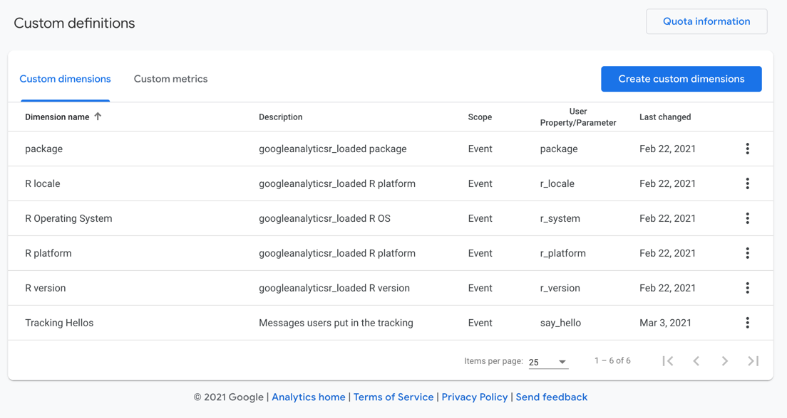

```{r, include = FALSE}
knitr::opts_chunk$set(
  collapse = TRUE,
  comment = "#>"
)
```

## R setup

To enable package tracking in your R package you need the following:

1. Add your API secret and measurementId to a `.trackme` environment within your package.  These are public so it is possible for people to use them to send data.

```r
.trackme <- new.env()
.trackme$measurement_id <- "G-1234"
.trackme$api <- "_hS_7VJXXXXXXX"
```

2. Document usage of `mp_trackme()` (or a wrapper function) that will let end-users opt in to tracking.

```r
mp_trackme("yourPackage")
```

Since you know the package name, it is recommended to wrap the functions above with the package filled in e.g. this package uses `mp_opt_in()` to ask for opt-in for its own stats (meta)

```r
mp_opt_in <- function(){
  mp_trackme("measurmentProtocol")
}
```

3. In an `.onAttach` start-up function add: `measurementProtocol::mp_trackme_event()` which will check for an opt-in file and send a message if it is not present, or if it is present will send the tracking event.  Also add in the name of your opt-in function to appear in the startup message:

```r
.onAttach <- function(libname, pkgname){
  measurementProtocol::mp_trackme_event(pkgname, opt_in_function = "mp_opt_in")
}

```

## GA4 setup

You need to add the custom definitions that will be sent in the tracking events.  They are shown below:



* package - the package name and version as returned by `paste(package,  utils::packageVersion(package))`
* r_locale - the locale as returned by `utils::sessionInfo()$locale`
* r_system - the system as returned by `utils::sessionInfo()$running`
* r_platform - the platform as returned by `utils::sessionInfo()$running`
* r_version - the version as returned by `utils::sessionInfo()$R.version$version.string`
* say_hello - a message users may add if you let them via `measurementProtocol::mp_trackme_event()`


## googleAnalyticsR package tracking with ga_trackme

`googleAnalyticsR` uses the above to provide opt-in tracking of what systems its running on. 

`ga_trackme()` is sent on package load if consent is given in the form of a file saved on the user's computer (much like a website cookie).

You can see what is sent with the `debug_call=TRUE` flag - the below is sent when this RMarkdown file renders:

```r
ga_trackme_event(debug_call = TRUE, say_hello = "Documentation is a feature")
```

Send your own messages if you like!  I will read them in the GA4 interface.


